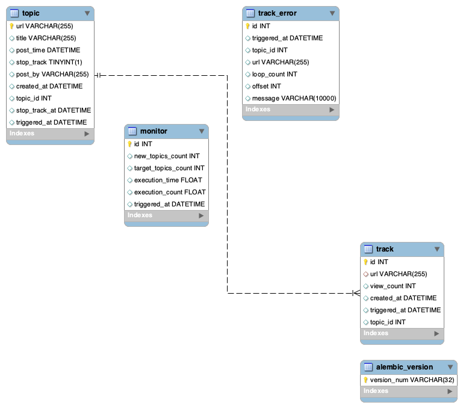

# QSearch 2nd Round by Hsinyi-Li

## 1. 連續監測 Mobile01 五日
### 監測日期
- 07/17-07/22
<br/><br/>

### 監測結果
- 總追蹤次數：40452
- 爬蟲啟動次數：367
- 追蹤文章數量：3183

&nbsp;&nbsp;&nbsp;&nbsp;&nbsp;&nbsp;&nbsp;&nbsp;以上結果為 07/15 18:50 至 07/23 09:43 期間的統計，含測試資料

- 07/17-07/18：未取得第六個小時的瀏覽人數。
- 07/19-07/20：07/20 早上十點因 GCP Cloud Run 無法預期的錯誤，無法取得資料，13 分鐘後手動爬取。除了該次意外，一切正常。
- 07/21-07/22：一切正常。
<br/><br/>

### 監測方式
&nbsp;&nbsp;&nbsp;&nbsp;&nbsp;&nbsp;&nbsp;&nbsp;每半個小時會掃一次 Mobile01 的新進文章頁面，將每篇文章的發文時間、標題、網址、文章編號記錄下來並存進資料庫中，直到文章編號小於資料庫內最新的文章編號為止。同時會為每篇文章加上一個「停止更新時間」，該時間為爬蟲啟動時間的七個小時後。

&nbsp;&nbsp;&nbsp;&nbsp;&nbsp;&nbsp;&nbsp;&nbsp;接著將資料庫內所有「停止更新時間」小於當前時間的文章標記為不需再追蹤，接著開始追蹤有效的文章。追蹤完成後，將訪問人數及相關資料寫入資料庫。整批完成後，將整批的執行資料，包含執行時間、目標文章數、實際追蹤文章數寫入資料庫內。其中如果遭遇錯誤，會先將文章網址暫存到新的清單，等原本的清單全部跑完後，會使用 Selenium 登入 Mobile01，並爬取新的清單內的網址。如果再遭遇錯誤，則會將網址及錯誤相關資訊寫進資料庫。

&nbsp;&nbsp;&nbsp;&nbsp;&nbsp;&nbsp;&nbsp;&nbsp;定時及工作流程採用 AWS Lambda, Step Function 與 Cloud Watch，工作節點則採用 GCP Cloud Run。用 Cloud Run 的原因是因為可以在上面安裝 Chrome ，藉此規避 Cloud Flare 的偵測。而 Step Function 有平行展開工作階段的機制， Cloud WorkFlow 則沒有。
<br/><br/>

### 資料庫結構

- topic: 發現新進文章後就會存入
- track: 存放追蹤文章的紀錄
- monitor: 每批爬蟲的執行紀錄
- track_error: 追蹤文章時如果出現錯誤，就會記錄在此。手動觀察後發現，會有錯誤的文章都是違反板規被移到站務討論區的文章。

---

### 開發過程
#### 1. Day1 07/12
&nbsp;&nbsp;&nbsp;&nbsp;&nbsp;&nbsp;&nbsp;&nbsp;用 requests 與 Selenium 測試該如何爬取才能夠避免被 CloudFlare 偵測，後來發現 Selenium 相對較不容易被偵測到，所以用它開發了基礎的爬蟲。而由於題目指定使用 MySQL 或 csv ，選用了比較容易管理的 MySQL，並配合 ORM 與 Migration 進行資料庫管理，完成了基本的資料表與 Schema。
<br/><br/>

#### 2. Day2 07/13
&nbsp;&nbsp;&nbsp;&nbsp;&nbsp;&nbsp;&nbsp;&nbsp;以之前專案的經驗將爬蟲修改為可以在 Step Function 上面跑的版本，並嘗試部署到 Lambda 上。但卻發現只要使用了 headless-chromium（Chrome 的 binary 版本），就一定會被偵測到，剩下的一天幾乎都在測試不同的 chrome_option。

&nbsp;&nbsp;&nbsp;&nbsp;&nbsp;&nbsp;&nbsp;&nbsp;此外，也進行了後續的開發時間評估。當時設想了兩個版本，一個版本就是現行版本，每半小時掃一次，頻率低所以不容易被偵測、穩定、開發難度較低，但每篇文章可能會有半個小時左右的延遲。理想版本則是每五分鐘掃一次新進文章，接著依據發文時間排定後續每半個小時的爬蟲，效率高，延遲低，但是比較有可能被偵測，開發難度也高。

&nbsp;&nbsp;&nbsp;&nbsp;&nbsp;&nbsp;&nbsp;&nbsp;當下就決定先用安全版本開發，觀察文章前半小時的觀看人數變化，再來決定要不要升級成理想版本。
<br/><br/>

#### 3. Day3 07/14
&nbsp;&nbsp;&nbsp;&nbsp;&nbsp;&nbsp;&nbsp;&nbsp;在一番搜尋後，覺得依照我目前的能力，應該只有在機器上安裝 Chrome 這個解法，所以有兩種選項：
- 在 AWS Lambda 或是同類型的無伺服器服務上安裝
- 在 AWS EC2 或是同類型的遠端機器上安裝

&nbsp;&nbsp;&nbsp;&nbsp;&nbsp;&nbsp;&nbsp;&nbsp;但因為一天要爬取 48 次，每次可能要爬 100 篇以上的文章，使用一台遠端機器會很容易被偵測，水平擴展的話又要考量技術門檻與預算。雖然也有考慮過用單台機器配合隨機 Proxy ，但因為對 Proxy 不熟悉，所以決定先探索選項一。

&nbsp;&nbsp;&nbsp;&nbsp;&nbsp;&nbsp;&nbsp;&nbsp;後來找到了[這篇教學](https://dev.to/googlecloud/using-headless-chrome-with-cloud-run-3fdp)，決定使用 Cloud Run 來搭建爬蟲。部署完加上測試就花了一天的時間。
<br/><br/>

#### 4. Day4 07/15
&nbsp;&nbsp;&nbsp;&nbsp;&nbsp;&nbsp;&nbsp;&nbsp;因為使用 Cloud Run ，所以原本想要直接配合 Cloud WorkFlow，但是發現似乎沒有平行展開工作階段的功能，所以就決定還是使用 Step Function 配合 Lambda 來呼叫 Cloud Run 的方式。

&nbsp;&nbsp;&nbsp;&nbsp;&nbsp;&nbsp;&nbsp;&nbsp;部署、測試加上調整爬蟲與資料表欄位就耗掉了一天，差不多在這個時候就覺得理想版本不可行了。從這天開始進行監測。
<br/><br/>

#### 5. Day5 07/16
&nbsp;&nbsp;&nbsp;&nbsp;&nbsp;&nbsp;&nbsp;&nbsp;由於離正式開始監測只剩一天，所以在進行最後的調整，並決定：
- 要不要使用 Proxy？
- 要不要追求理想版本？

&nbsp;&nbsp;&nbsp;&nbsp;&nbsp;&nbsp;&nbsp;&nbsp;Proxy 的部分，在短暫的搜尋之後，得知 Proxy 其實也不穩定，所以決定先來測試看看 Cloud Run 的 IP 是否會輪換。測試結果是會，所以就先放棄 Proxy。

&nbsp;&nbsp;&nbsp;&nbsp;&nbsp;&nbsp;&nbsp;&nbsp;而觀看了 Day4-5 的爬蟲結果之後，發現在 111 篇文章裡面有 52 篇的觀看次數為 0， 42 篇的觀看次數介於 11-33 之間，代表大部分文章在發文後半小時內的觀看次數變化不大，加上開發時間不夠，所以決定使用現行版本。
<br/><br/>

#### 6. Day6-7 07/17-07/18
&nbsp;&nbsp;&nbsp;&nbsp;&nbsp;&nbsp;&nbsp;&nbsp;開始正式的監測，並不定時手動觀察資料。在 07/18 晚上抽樣時，發現由於停止更新時間是以發文時間加六小時來設定，因此會沒有辦法抓到第六個小時的結果。例如：

&nbsp;&nbsp;&nbsp;&nbsp;&nbsp;&nbsp;&nbsp;&nbsp;16:01 發的文章，理論上到 22:30 時也要收入追蹤結果（因為 16:01 + 06:00 = 22:01），但依照現行機制，會在 22:30 時就當作停止更新，因此不會追蹤。

&nbsp;&nbsp;&nbsp;&nbsp;&nbsp;&nbsp;&nbsp;&nbsp;所以將停止更新時間改為「爬蟲啟動時間加七小時」，來確保會取得所有應該要取得的資料。
<br/><br/>

#### 7. Day 8-9 07/19-07/20
&nbsp;&nbsp;&nbsp;&nbsp;&nbsp;&nbsp;&nbsp;&nbsp;修改爬蟲後一切正常，直到 07/20 早上十點時收到通知說爬蟲發生錯誤。點開紀錄檔來看，發現是其中一隻爬蟲五分鐘都沒有回應而 Time Out，但是依照目前的爬蟲設計，每隻爬蟲運行時間最多不應該超過 2 分鐘。所以懷疑是 Cloud Run 本身發生了無法預期的錯誤而導致，沒有調整程式碼。
<br/><br/>

#### 8. Day 10-11 07/21-07/22
&nbsp;&nbsp;&nbsp;&nbsp;&nbsp;&nbsp;&nbsp;&nbsp;撰寫圖表繪製程式，輸出 schema，README 調整。

---

## 2. 登入臉書並傳送訊息給粉絲頁
### 達成方式
&nbsp;&nbsp;&nbsp;&nbsp;&nbsp;&nbsp;&nbsp;&nbsp;利用 requests.session 建立一個 Session，接著透過訪問 https://www.messenger.com 取得 identifer, initial_request_id 與其他登入相關資料，同時設定了 cookie:_js_datr

&nbsp;&nbsp;&nbsp;&nbsp;&nbsp;&nbsp;&nbsp;&nbsp;接著訪問 https://www.facebook.com/login/messenger_dot_com_iframe/ ，透過該網址設定 cookie:datr, fr。再帶著信箱、密碼以及帶有 UA, Referer 等資訊的 Headers post 到 https://www.messenger.com/login/password/ ，就登入成功了。

&nbsp;&nbsp;&nbsp;&nbsp;&nbsp;&nbsp;&nbsp;&nbsp;登入成功後，FB 會回傳一個完整的 HTML 檔，從中取出需要的資訊後，與要傳送的訊息組合， post 到 https://www.messenger.com/messaging/send/ 就完成訊息傳送了
<br/><br/>

### 開發過程
&nbsp;&nbsp;&nbsp;&nbsp;&nbsp;&nbsp;&nbsp;&nbsp;一開始由於對 FB 相關登入機制不熟，所以先用 Selenium-Wire 做了一個簡單的登入、傳送訊息，並從中取得登入時會用到的 headers 跟 params，配合 requests.session.post 登入。

&nbsp;&nbsp;&nbsp;&nbsp;&nbsp;&nbsp;&nbsp;&nbsp;雖然初步測試成功，但遇到了兩個問題，一個是 Selenium-Wire 取得的資料如果沒有馬上使用就會失效。另一個則是無法參透該怎麼傳送訊息。所以後來上網研究有沒有別人寫好的 code 可以參考，找到了兩個：

- fb-chat: https://github.com/fbchat-dev/fbchat
- messenger-api: https://github.com/JuniorJPDJ/messenger_api

&nbsp;&nbsp;&nbsp;&nbsp;&nbsp;&nbsp;&nbsp;&nbsp;兩個包雖然都已經沒有再繼續維護下去了，但透過拆解他們了解到我其實有機會完全不用 Selenium。我兩個都嘗試一輪後發現都無法登入，但觀察他們的程式碼，發現他們帶的 Headers 都只有 User-Agent，而且都包含了套件跟開發者的資訊，例如：

```{'User-agent': 'Mozilla/5.0 ;compatible; PyMessengerAPI/{}; KaziCiota; +http://juniorjpdj.pl;'.format(__version__) if useragent == 'default' else useragent}```

&nbsp;&nbsp;&nbsp;&nbsp;&nbsp;&nbsp;&nbsp;&nbsp;所以我就更換為之前透過 Selenium-Wire 取得的 Headers，並把部分（例如lsd_token 等跟帳號驗證相關的）資訊刪除後，就可以成功使用 messenger-api 的 code 登入並傳送訊息了。

&nbsp;&nbsp;&nbsp;&nbsp;&nbsp;&nbsp;&nbsp;&nbsp;接著就是將程式碼清理乾淨，把這次題目不需要的部分，例如上傳檔案功能刪除後再進行測試：
先是用開發者測試帳號互傳訊息，接著再創一個假帳號，傳送訊息給我的真實帳號，最後才是傳送訊息給 QSearch2012。
<br/><br/>

## 3. 如果每日有 500 萬新網頁資料進入資料庫，對於資料庫的建置與選擇有什麼看法？
&nbsp;&nbsp;&nbsp;&nbsp;&nbsp;&nbsp;&nbsp;&nbsp;首先，由於五百萬筆網頁的資料量相當龐大，我會選擇先以 json 格式存到 Cloud Storage 或 S3，並用 Big Query 或 Athena 來進行查詢，與分析相關成員確認需求後，再來規劃後續的 ETL 與資料庫。
<br/><br/>

&nbsp;&nbsp;&nbsp;&nbsp;&nbsp;&nbsp;&nbsp;&nbsp;如果這些資料可以單獨使用，不需要與其他來源的資料作 join 查詢，也沒有需要經常性的變更/交易的話，我會優先考慮使用 NoSQL 資料庫，例如Cloud Datastore 或 MongoDB，因為使用起來相對彈性，而且因為 schema-less，可以一開始先用比較小台的機器，再視需求水平擴展。
<br/><br/>

&nbsp;&nbsp;&nbsp;&nbsp;&nbsp;&nbsp;&nbsp;&nbsp;但如果這些資料要跟其他來源的資料配合使用，或是需要經常性的變更/交易的話，我會優先考慮使用 SQL 資料庫，例如 MySQL 或 PostgreSQL。這樣才能確保資料在每次交易時的穩定性，而且新成員也能快速地透過 schema 來了解資料的架構。只是在機器架設時，就要先評估會存放多少資料來決定開什麼等級的機器。因為 SQL 資料庫的水平擴展比較困難，而向上升級又會有資料搬遷、備份的考量。